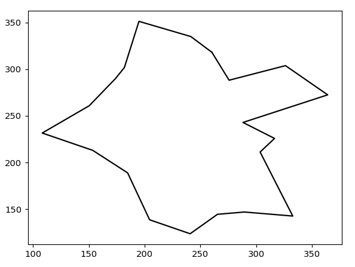
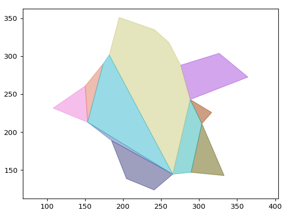

# Decomposition

> A convex decomposition of a polygon P is a set of convex polygons whose union gives P, and such that the intersection of any two of them, if nonempty, consists totally of edges and vertices.
>
> -<cite>from the paper</cite>

## Algorithm Overview

Given a non convex polygon, the algorithm picks a point as the starting point and chops off convex pieces iteratively till a convex polygon remains.

!!!danger Last Polygon
While decomposing a polygon like a star, after chopping off convex triangles we are left with the middle part that is entirely made of diagonals. This last polygon made of diagonals is stored separately as `lastPolygonAdded`.
!!!

## Example

+++ Original Polygon

+++ Decomposed Polygon

+++
