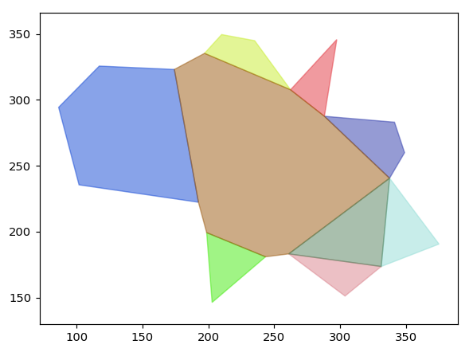
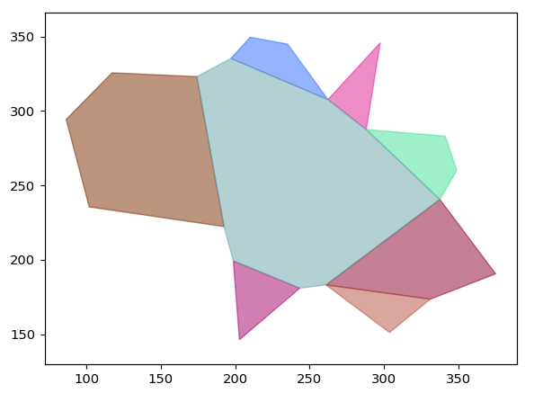

# Merging

The decomposition obtained by the earlier algorithm may not be _optimal_; containing some non essential diagonals which on removing (and henve merging the adjacent polygons) lead to a larger convex polygon, effectively decreasing the total number of convex polygons.

This is fixed by applying a merging algorithm to the previous decomposition.

## Overview

The algorithm iterates through all the diagonals, checking whether the diagonal can be removed.
!!!
A diagonal can be removed only if the diagonal's edges are not notches in the suspected "merged" polygon.
!!!
On removing a valid nonessential diagonal, the polygons are merged and the list of polygons updated.

This goes on till all diagonals are visited.

## Example

We see that the bottom right polygon has been merged.
+++ Decomposed Polygon

+++ Merged

