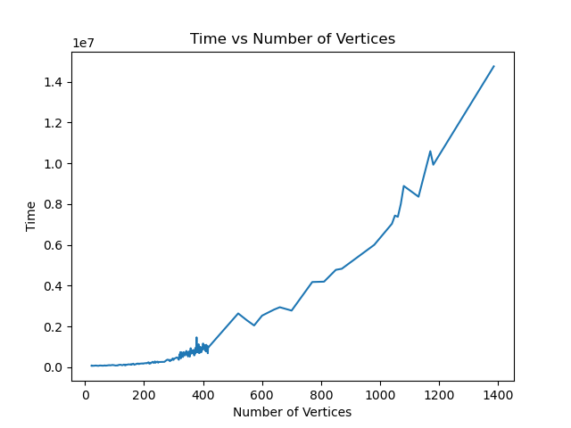
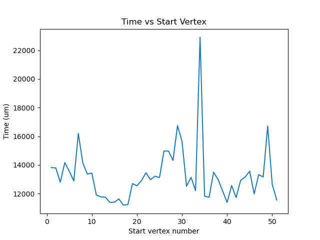

# Time analysis

## Runtime vs input size

Time (in microseconds) against the number of input polygon's number of vertices is plotted below.

More polygons were run in the 300-400 range, resulting in a highly varying times depending on the start time. However, we see that the general trend follows $O(n^2)$ time complexity.

## Time taken for various starting vertex

Since the decomposition and time taken depends on the starting vertex, we ran the above polygon decomposition sequentially by taking each vertex as the starting vertex. The times taken for each run of the program is shown as a line graph.

The spike suggests that the algorithm couldn't obtain a convex polygon that started at the "current" vertex and had to switch start vertices multiple times. Since the switching operation takes linear time, we can see that this added up to increase the total running time for the whole decomposition.

## Decomposition and merging times vs notches

We ran the algorithm on random polygons having 25 points and varying notches. Time is given for decomposition, merging and total in microseconds.

We see that the time increases with the number of notches.

| n   | notches | decompose | merge | total |
| --- | ------- | --------- | ----- | ----- |
| 25  | 9       | 855       | 660   | 1515  |
| 25  | 10      | 1167      | 984   | 2151  |
| 25  | 10      | 906       | 1084  | 1990  |
| 25  | 10      | 1172      | 872   | 2044  |
| 25  | 10      | 1195      | 1068  | 2263  |
| 25  | 11      | 1155      | 880   | 2035  |
| 25  | 11      | 1193      | 1051  | 2244  |
| 25  | 11      | 1285      | 1047  | 2332  |
| 25  | 11      | 1056      | 1000  | 2056  |
| 25  | 11      | 1064      | 1028  | 2092  |
| 25  | 11      | 1343      | 1059  | 2402  |
| 25  | 11      | 1247      | 850   | 2097  |
| 25  | 11      | 1298      | 532   | 1830  |
| 25  | 11      | 1333      | 535   | 1868  |
| 25  | 11      | 1450      | 529   | 1979  |
| 25  | 12      | 1490      | 925   | 2415  |
| 25  | 12      | 1238      | 858   | 2096  |
| 25  | 13      | 1781      | 1051  | 2832  |
| 35  | 12      | 2041      | 1463  | 3504  |
| 35  | 14      | 2160      | 1514  | 3674  |
| 35  | 15      | 2154      | 1935  | 4089  |
| 35  | 15      | 2447      | 1542  | 3989  |
| 35  | 15      | 2376      | 1437  | 3813  |
| 35  | 15      | 3052      | 1987  | 5039  |
| 35  | 16      | 2331      | 1643  | 3974  |
| 35  | 17      | 2823      | 2460  | 5283  |
